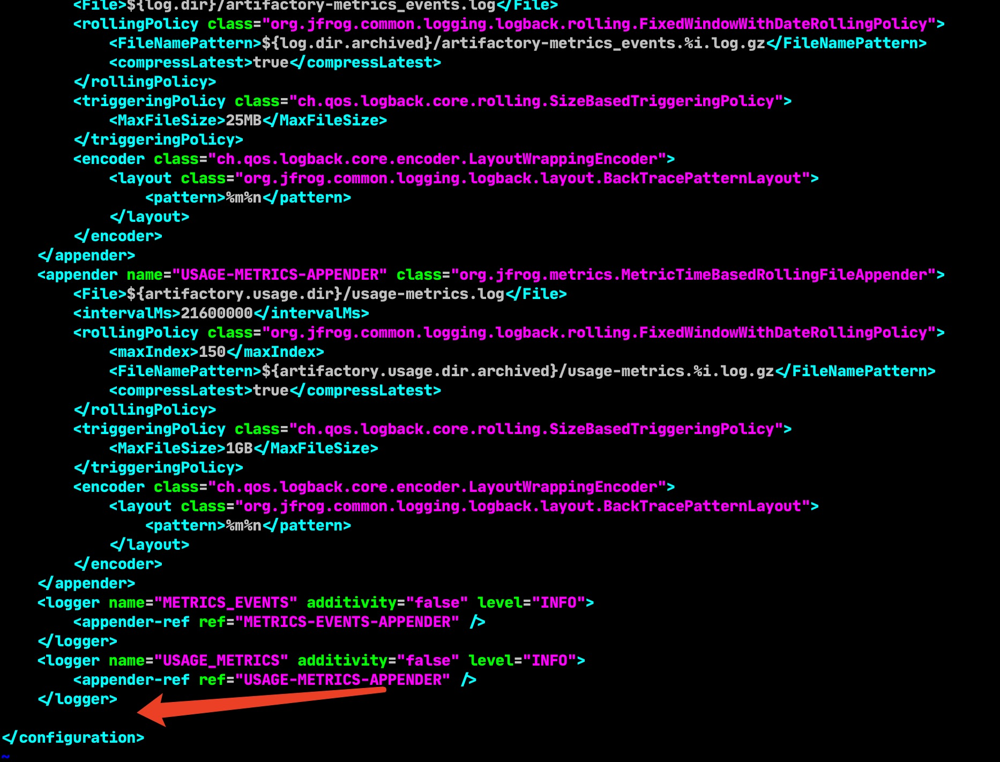

配置Artifactory logback.xml

把下面配置贴入配置文件中
$JFROG_HOME/var/etc/artifactory/logback.xml



```xml
    <appender name="aql" class="ch.qos.logback.core.rolling.RollingFileAppender">
        <File>${log.dir}/aql-minitor.log</File><!--AQL独立log文件名-->
        <encoder class="ch.qos.logback.core.encoder.LayoutWrappingEncoder">
            <layout class="org.jfrog.common.logging.logback.layout.BackTracePatternLayout">
                <pattern>%d{yyyy-MM-dd'T'HH:mm:ss.SSS, UTC}Z %boldGreen([jfrt ]) %highlight([%-5p]) [%-16X{uber-trace-id}] [%-30.30(%c{3}:%L)] [%-20.20thread] - %m%n</pattern>
            </layout>
        </encoder>
        <rollingPolicy class="ch.qos.logback.core.rolling.FixedWindowRollingPolicy">
            <FileNamePattern>${log.dir.archived}/aql-minitor.%i.log</FileNamePattern>
            <maxIndex>13</maxIndex>
        </rollingPolicy>
        <triggeringPolicy class="ch.qos.logback.core.rolling.SizeBasedTriggeringPolicy">
            <MaxFileSize>10MB</MaxFileSize>
        </triggeringPolicy>
    </appender>
    <logger name="org.artifactory.storage.db.aql.itest.service.AqlServiceImpl" additivity="false"><!--additivity 设置为false主日志中不会继续打印AQL相关的log-->
        <level value="trace" /><!--debug, info , warn , error -->
        <appender-ref ref="aql" />
    </logger>
```